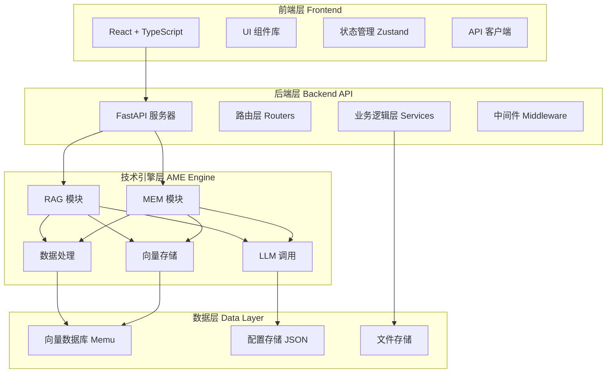
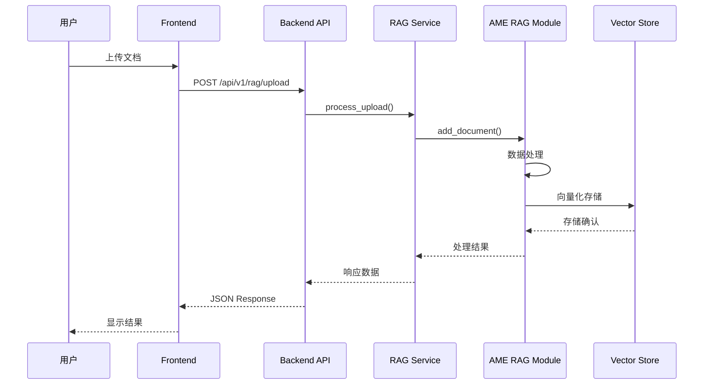
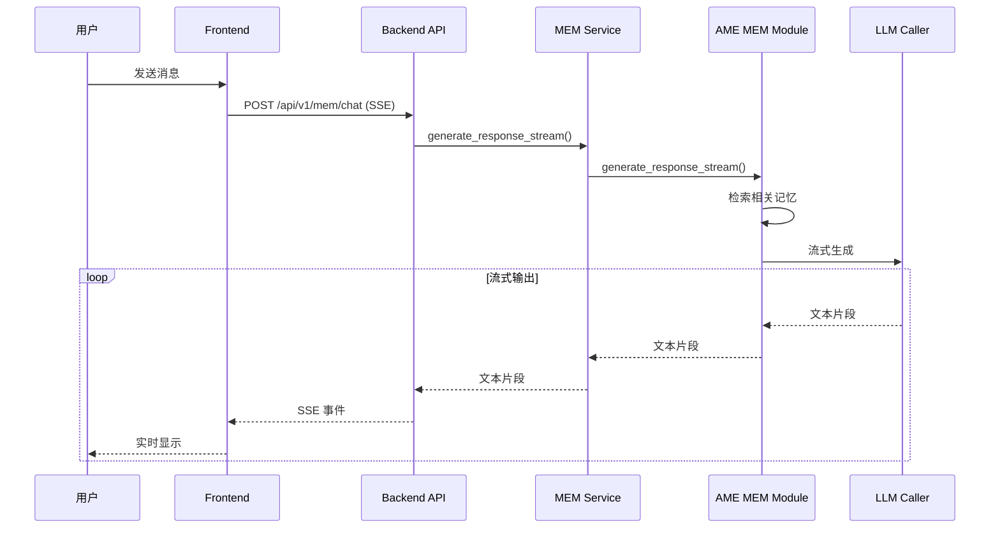
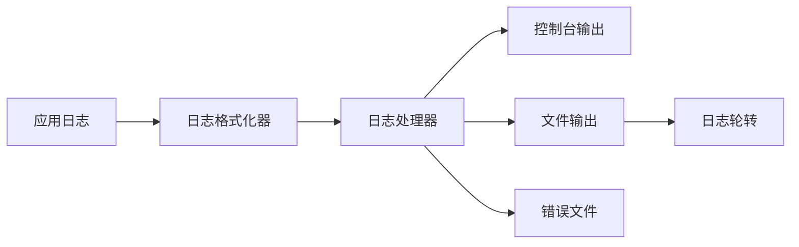
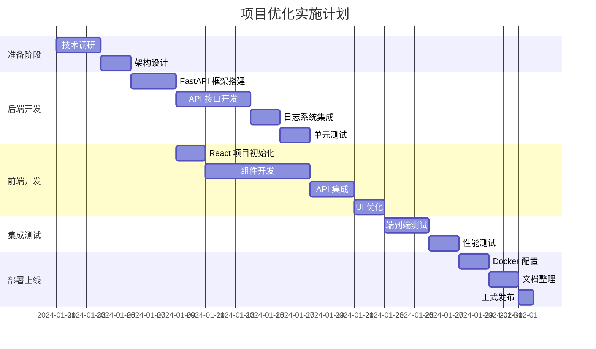

# Another Me - 项目框架优化设计文档

## 1. 概述

### 1.1 项目背景

Another Me 是一个基于 RAG 技术和记忆模仿的 AI 数字分身系统，当前采用 Python Gradio 框架作为前端，AME (Another Me Engine) 作为独立技术引擎。

**当前版本**: v0.7.0  
**项目类型**: 全栈 AI 应用（Python Gradio + AME 技术引擎）

### 1.2 优化目标

1. **前端框架迁移**: 从 Gradio (Python) 迁移到现代 JavaScript 前后端分离架构
2. **整体逻辑优化**: 优化系统架构、数据流和业务逻辑
3. **功能保障**: 确保核心功能（对话、知识库、记忆管理）完整可用
4. **文档清晰化**: 简化文档结构，删除冗余文件
5. **日志系统**: 建立统一、清晰的日志管理体系
6. **系统增强**: 基于最佳实践进行全面优化

### 1.3 技术栈变更

#### 优化前
- **前端**: Gradio 4.0 (Python 框架)
- **后端**: AME 技术引擎（直接调用）
- **架构**: 单体 Python 应用

#### 优化后
- **前端**: React 18 + TypeScript + Vite
- **后端**: FastAPI (Python 3.11+)
- **技术引擎**: AME (独立模块)
- **架构**: 前后端分离 + RESTful API

---

## 2. 架构设计

### 2.1 整体架构



### 2.2 目录结构设计

```
another-me/
├── frontend/                   # 前端应用
│   ├── src/
│   │   ├── components/         # UI 组件
│   │   │   ├── common/         # 通用组件
│   │   │   ├── rag/            # RAG 功能组件
│   │   │   ├── mem/            # MEM 功能组件
│   │   │   └── layout/         # 布局组件
│   │   ├── pages/              # 页面
│   │   │   ├── Home.tsx
│   │   │   ├── Chat.tsx        # MEM 对话页
│   │   │   ├── Knowledge.tsx   # RAG 知识库
│   │   │   ├── Memory.tsx      # 记忆管理
│   │   │   └── Config.tsx      # 配置页
│   │   ├── api/                # API 客户端
│   │   ├── store/              # 状态管理
│   │   ├── hooks/              # React Hooks
│   │   ├── utils/              # 工具函数
│   │   └── types/              # TypeScript 类型
│   ├── public/
│   ├── package.json
│   ├── vite.config.ts
│   └── tsconfig.json
│
├── backend/                    # 后端 API
│   ├── app/
│   │   ├── api/                # API 路由
│   │   │   ├── v1/
│   │   │   │   ├── rag.py      # RAG 接口
│   │   │   │   ├── mem.py      # MEM 接口
│   │   │   │   ├── config.py   # 配置接口
│   │   │   │   └── health.py   # 健康检查
│   │   │   └── deps.py         # 依赖注入
│   │   ├── services/           # 业务逻辑
│   │   │   ├── rag_service.py
│   │   │   ├── mem_service.py
│   │   │   └── config_service.py
│   │   ├── middleware/         # 中间件
│   │   │   ├── cors.py
│   │   │   ├── logging.py
│   │   │   └── error_handler.py
│   │   ├── core/               # 核心配置
│   │   │   ├── config.py
│   │   │   ├── logger.py
│   │   │   └── security.py
│   │   ├── models/             # 数据模型
│   │   │   ├── requests.py
│   │   │   └── responses.py
│   │   └── main.py             # 应用入口
│   ├── tests/                  # 单元测试
│   └── requirements.txt
│
├── ame/                        # AME 技术引擎（保持不变）
│   ├── rag/
│   ├── mem/
│   ├── data_processor/
│   ├── vector_store/
│   ├── llm_caller/
│   ├── retrieval/
│   └── README.md
│
├── data/                       # 数据目录
│   ├── rag_vector_store/       # RAG 向量库
│   ├── mem_vector_store/       # MEM 向量库
│   ├── uploads/                # 上传文件
│   ├── logs/                   # 日志文件
│   └── config/                 # 配置文件
│
├── deployment/                 # 部署相关
│   ├── docker/
│   │   ├── Dockerfile.frontend
│   │   ├── Dockerfile.backend
│   │   └── nginx.conf
│   ├── docker-compose.yml
│   └── deploy.sh
│
├── docs/                       # 文档
│   ├── README.md               # 项目说明
│   ├── API.md                  # API 文档
│   ├── DEPLOYMENT.md           # 部署指南
│   └── DEVELOPMENT.md          # 开发指南
│
└── README.md                   # 项目入口文档
```

### 2.3 数据流设计

#### RAG 知识库数据流



#### MEM 对话数据流（流式输出）



---

## 3. 前端架构

### 3.1 技术选型

| 技术 | 版本 | 用途 |
|------|------|------|
| React | 18.x | UI 框架 |
| TypeScript | 5.x | 类型安全 |
| Vite | 5.x | 构建工具 |
| Zustand | 4.x | 状态管理 |
| TanStack Query | 5.x | 数据请求 |
| Ant Design | 5.x | UI 组件库 |
| TailwindCSS | 3.x | 样式框架 |
| Axios | 1.x | HTTP 客户端 |
| React Router | 6.x | 路由管理 |

### 3.2 组件架构

#### 组件层次结构

```
App
├── Layout
│   ├── Header
│   ├── Sidebar
│   └── Content
│       ├── HomePage
│       ├── ChatPage (MEM)
│       │   ├── ChatWindow
│       │   ├── MessageList
│       │   ├── MessageInput
│       │   └── ChatSettings
│       ├── KnowledgePage (RAG)
│       │   ├── DocumentUpload
│       │   ├── DocumentList
│       │   ├── SearchPanel
│       │   └── StatsCard
│       ├── MemoryPage
│       │   ├── MemoryTimeline
│       │   ├── MemorySearch
│       │   └── MemoryStats
│       └── ConfigPage
│           ├── APIKeyConfig
│           ├── ModelConfig
│           └── SystemConfig
```

### 3.3 状态管理设计

使用 Zustand 进行全局状态管理：

```typescript
// 配置状态
interface ConfigStore {
  apiKey: string;
  baseUrl: string;
  model: string;
  isConfigured: boolean;
  setConfig: (config: Partial<ConfigState>) => void;
}

// 聊天状态
interface ChatStore {
  messages: Message[];
  isLoading: boolean;
  addMessage: (message: Message) => void;
  clearMessages: () => void;
}

// RAG 状态
interface RAGStore {
  documents: Document[];
  stats: RAGStats;
  updateDocuments: (docs: Document[]) => void;
  updateStats: (stats: RAGStats) => void;
}
```

### 3.4 API 客户端设计

```typescript
// api/client.ts
class APIClient {
  private baseURL: string;
  private axios: AxiosInstance;
  
  constructor() {
    this.baseURL = import.meta.env.VITE_API_BASE_URL;
    this.axios = axios.create({
      baseURL: this.baseURL,
      timeout: 30000,
    });
  }
  
  // RAG API
  rag = {
    upload: (file: File) => Promise<UploadResponse>,
    search: (query: string) => Promise<SearchResponse>,
    getStats: () => Promise<RAGStats>,
    deleteDocument: (id: string) => Promise<void>,
  };
  
  // MEM API
  mem = {
    chat: (message: string) => EventSource, // SSE
    getMemories: () => Promise<Memory[]>,
    deleteMemory: (id: string) => Promise<void>,
  };
  
  // Config API
  config = {
    save: (config: APIConfig) => Promise<void>,
    test: (config: APIConfig) => Promise<TestResult>,
  };
}
```

---

## 4. 后端架构

### 4.1 FastAPI 应用结构

#### 主应用入口 (main.py)

```python
from fastapi import FastAPI
from fastapi.middleware.cors import CORSMiddleware
from app.api.v1 import rag, mem, config, health
from app.middleware.logging import LoggingMiddleware
from app.middleware.error_handler import ErrorHandlerMiddleware
from app.core.config import settings
from app.core.logger import setup_logging

# 初始化日志
setup_logging()

app = FastAPI(
    title="Another Me API",
    version="1.0.0",
    description="AI 数字分身系统 API"
)

# 中间件
app.add_middleware(
    CORSMiddleware,
    allow_origins=settings.ALLOWED_ORIGINS,
    allow_credentials=True,
    allow_methods=["*"],
    allow_headers=["*"],
)
app.add_middleware(LoggingMiddleware)
app.add_middleware(ErrorHandlerMiddleware)

# 路由
app.include_router(health.router, prefix="/api/v1", tags=["health"])
app.include_router(rag.router, prefix="/api/v1/rag", tags=["rag"])
app.include_router(mem.router, prefix="/api/v1/mem", tags=["mem"])
app.include_router(config.router, prefix="/api/v1/config", tags=["config"])
```

### 4.2 API 端点设计

#### RAG 知识库 API

```python
# app/api/v1/rag.py
from fastapi import APIRouter, UploadFile, File, Depends
from app.services.rag_service import RAGService
from app.models.responses import UploadResponse, SearchResponse

router = APIRouter()

@router.post("/upload", response_model=UploadResponse)
async def upload_document(
    file: UploadFile = File(...),
    service: RAGService = Depends()
):
    """上传文档到知识库"""
    pass

@router.post("/search", response_model=SearchResponse)
async def search_knowledge(
    query: str,
    top_k: int = 5,
    service: RAGService = Depends()
):
    """检索知识库"""
    pass

@router.get("/documents", response_model=List[Document])
async def get_documents(service: RAGService = Depends()):
    """获取所有文档"""
    pass

@router.delete("/documents/{doc_id}")
async def delete_document(
    doc_id: str,
    service: RAGService = Depends()
):
    """删除文档"""
    pass

@router.get("/stats", response_model=RAGStats)
async def get_stats(service: RAGService = Depends()):
    """获取统计信息"""
    pass
```

#### MEM 对话 API

```python
# app/api/v1/mem.py
from fastapi import APIRouter, Depends
from fastapi.responses import StreamingResponse
from app.services.mem_service import MEMService

router = APIRouter()

@router.post("/chat")
async def chat(
    message: str,
    service: MEMService = Depends()
):
    """流式对话接口（SSE）"""
    async def event_generator():
        async for chunk in service.chat_stream(message):
            yield f"data: {chunk}\n\n"
    
    return StreamingResponse(
        event_generator(),
        media_type="text/event-stream"
    )

@router.post("/learn")
async def learn_from_conversation(
    message: str,
    context: str = None,
    service: MEMService = Depends()
):
    """学习对话"""
    pass

@router.get("/memories")
async def get_memories(service: MEMService = Depends()):
    """获取记忆列表"""
    pass
```

### 4.3 服务层设计

#### RAG 服务

```python
# app/services/rag_service.py
from ame.rag.knowledge_base import KnowledgeBase
from app.core.logger import get_logger

logger = get_logger(__name__)

class RAGService:
    def __init__(self):
        self.kb = KnowledgeBase(
            vector_store_type="memu",
            db_path="/app/data/rag_vector_store"
        )
    
    async def upload_document(self, file_path: str):
        """上传文档"""
        logger.info(f"Uploading document: {file_path}")
        result = await self.kb.add_document(file_path)
        logger.info(f"Document uploaded: {result}")
        return result
    
    async def search(self, query: str, top_k: int = 5):
        """检索知识"""
        logger.debug(f"Searching: {query}")
        results = await self.kb.search(query, top_k)
        return results
```

#### MEM 服务

```python
# app/services/mem_service.py
from ame.mem.mimic_engine import MimicEngine
from ame.llm_caller.caller import LLMCaller
from app.core.config import get_config
from app.core.logger import get_logger

logger = get_logger(__name__)

class MEMService:
    def __init__(self):
        config = get_config()
        llm_caller = LLMCaller(
            api_key=config.OPENAI_API_KEY,
            base_url=config.OPENAI_BASE_URL,
            model=config.OPENAI_MODEL
        )
        self.engine = MimicEngine(
            llm_caller=llm_caller,
            db_path="/app/data/mem_vector_store"
        )
    
    async def chat_stream(self, message: str):
        """流式对话"""
        logger.info(f"Chat request: {message}")
        async for chunk in self.engine.generate_response_stream(message):
            yield chunk
```

---

## 5. 日志系统设计

### 5.1 日志架构



### 5.2 日志配置

```python
# backend/app/core/logger.py
import logging
from logging.handlers import RotatingFileHandler
import sys
from pathlib import Path

# 日志目录
LOG_DIR = Path("/app/data/logs")
LOG_DIR.mkdir(parents=True, exist_ok=True)

# 日志格式
LOG_FORMAT = "%(asctime)s - %(name)s - %(levelname)s - %(message)s"
DATE_FORMAT = "%Y-%m-%d %H:%M:%S"

def setup_logging():
    """设置日志系统"""
    
    # 根日志器
    root_logger = logging.getLogger()
    root_logger.setLevel(logging.INFO)
    
    # 格式化器
    formatter = logging.Formatter(LOG_FORMAT, DATE_FORMAT)
    
    # 控制台处理器
    console_handler = logging.StreamHandler(sys.stdout)
    console_handler.setLevel(logging.INFO)
    console_handler.setFormatter(formatter)
    
    # 文件处理器（所有日志）
    file_handler = RotatingFileHandler(
        LOG_DIR / "app.log",
        maxBytes=10*1024*1024,  # 10MB
        backupCount=10
    )
    file_handler.setLevel(logging.DEBUG)
    file_handler.setFormatter(formatter)
    
    # 错误文件处理器
    error_handler = RotatingFileHandler(
        LOG_DIR / "error.log",
        maxBytes=10*1024*1024,
        backupCount=5
    )
    error_handler.setLevel(logging.ERROR)
    error_handler.setFormatter(formatter)
    
    # 添加处理器
    root_logger.addHandler(console_handler)
    root_logger.addHandler(file_handler)
    root_logger.addHandler(error_handler)

def get_logger(name: str):
    """获取日志器"""
    return logging.getLogger(name)
```

### 5.3 日志级别规范

| 级别 | 使用场景 | 示例 |
|------|---------|------|
| DEBUG | 详细调试信息 | 函数参数、中间变量 |
| INFO | 关键流程信息 | 请求处理、业务操作 |
| WARNING | 警告信息 | 配置缺失、降级处理 |
| ERROR | 错误信息 | 异常捕获、操作失败 |
| CRITICAL | 严重错误 | 系统崩溃、数据损坏 |

### 5.4 日志记录规范

```python
# 好的日志实践
logger.info(f"User upload document: {filename}, size: {size}")
logger.error(f"Failed to process document: {filename}", exc_info=True)
logger.debug(f"RAG search query: {query}, results: {len(results)}")

# 避免的做法
logger.info("Document uploaded")  # 缺少上下文
print("Error occurred")  # 不使用 logger
logger.info(sensitive_data)  # 记录敏感信息
```

---

## 6. 部署架构

### 6.1 Docker Compose 架构

```yaml
# deployment/docker-compose.yml
version: '3.8'

services:
  frontend:
    build:
      context: ../
      dockerfile: deployment/docker/Dockerfile.frontend
    ports:
      - "${FRONTEND_PORT:-3000}:80"
    depends_on:
      - backend
    networks:
      - another-me-network
  
  backend:
    build:
      context: ../
      dockerfile: deployment/docker/Dockerfile.backend
    ports:
      - "${BACKEND_PORT:-8000}:8000"
    volumes:
      - ../data:/app/data
      - ../ame:/app/ame
    env_file:
      - ../.env
    networks:
      - another-me-network
    restart: unless-stopped

networks:
  another-me-network:
    driver: bridge

volumes:
  app-data:
```

### 6.2 Nginx 配置

```nginx
# deployment/docker/nginx.conf
server {
    listen 80;
    server_name localhost;
    
    # 前端静态文件
    location / {
        root /usr/share/nginx/html;
        try_files $uri $uri/ /index.html;
    }
    
    # API 代理
    location /api {
        proxy_pass http://backend:8000;
        proxy_set_header Host $host;
        proxy_set_header X-Real-IP $remote_addr;
        proxy_set_header X-Forwarded-For $proxy_add_x_forwarded_for;
        
        # SSE 支持
        proxy_buffering off;
        proxy_cache off;
        proxy_http_version 1.1;
        chunked_transfer_encoding off;
    }
}
```

---

## 7. 优化改进

### 7.1 性能优化

#### 前端优化

| 优化项 | 方案 | 预期提升 |
|--------|------|----------|
| 代码分割 | React.lazy + Suspense | 首屏加载 -40% |
| 资源压缩 | Vite 构建优化 | 包体积 -30% |
| 缓存策略 | TanStack Query | API 调用 -50% |
| 虚拟滚动 | react-window | 长列表性能 +200% |

#### 后端优化

| 优化项 | 方案 | 预期提升 |
|--------|------|----------|
| 异步处理 | asyncio | 并发能力 +300% |
| 连接池 | 数据库连接池 | 响应时间 -30% |
| 缓存 | LRU Cache | 重复查询 -80% |
| 批处理 | 批量向量化 | 文档处理 +150% |

### 7.2 安全优化

1. **API 认证**: JWT Token 认证
2. **CORS 配置**: 白名单限制
3. **输入验证**: Pydantic 模型验证
4. **文件上传**: 类型和大小限制
5. **敏感信息**: 环境变量管理

### 7.3 监控与告警

```python
# 性能监控中间件
class PerformanceMiddleware:
    async def __call__(self, request, call_next):
        start_time = time.time()
        response = await call_next(request)
        process_time = time.time() - start_time
        
        # 记录慢请求
        if process_time > 2.0:
            logger.warning(
                f"Slow request: {request.url.path} "
                f"took {process_time:.2f}s"
            )
        
        response.headers["X-Process-Time"] = str(process_time)
        return response
```

---

## 8. 数据迁移方案

### 8.1 Gradio → 新架构数据迁移

```python
# scripts/migrate_data.py
import asyncio
from pathlib import Path

class DataMigrator:
    """数据迁移工具"""
    
    async def migrate_vector_store(self):
        """迁移向量数据库"""
        # 从旧路径复制到新路径
        old_rag_path = "/app/data/rag_vector_store"
        new_rag_path = "/app/data/rag_vector_store"
        # 数据结构保持不变，直接复制
    
    async def migrate_config(self):
        """迁移配置文件"""
        # 从 Gradio session 提取配置
        # 转换为新的配置格式
    
    async def migrate_logs(self):
        """迁移日志文件"""
        # 整理旧日志，移动到新日志目录
```

---

## 9. 测试策略

### 9.1 单元测试

```python
# backend/tests/test_rag_service.py
import pytest
from app.services.rag_service import RAGService

@pytest.mark.asyncio
async def test_upload_document():
    service = RAGService()
    result = await service.upload_document("test.txt")
    assert result["success"] == True

@pytest.mark.asyncio
async def test_search():
    service = RAGService()
    results = await service.search("测试查询")
    assert len(results) > 0
```

### 9.2 集成测试

```typescript
// frontend/src/tests/api.test.ts
import { describe, it, expect } from 'vitest';
import { apiClient } from '@/api/client';

describe('RAG API', () => {
  it('should upload document', async () => {
    const file = new File(['test'], 'test.txt');
    const result = await apiClient.rag.upload(file);
    expect(result.success).toBe(true);
  });
});
```

---

## 10. 文档结构优化

### 10.1 文档清理

**删除文件**:
- `FRONTEND_OPTIMIZATION.md` （冗余）
- `GRADIO_MIGRATION_REPORT.md` （已完成迁移）
- `OPTIMIZATION_REPORT.md` （冗余）
- `gradio_app/OPTIMIZATION_SUMMARY.md` （冗余）
- `gradio_app/VISUAL_PREVIEW.md` （冗余）

### 10.2 新文档结构

```
docs/
├── README.md                   # 项目说明（用户向）
├── API.md                      # API 文档（开发者向）
├── DEPLOYMENT.md               # 部署指南
├── DEVELOPMENT.md              # 开发指南
└── CHANGELOG.md                # 变更日志
```

### 10.3 README 内容规范

```markdown
# Another Me - AI 数字分身系统

## 快速开始
- 一键部署
- 基本使用

## 核心功能
- RAG 知识库
- MEM 对话
- 记忆管理

## 技术栈
- 前端: React + TypeScript
- 后端: FastAPI
- 引擎: AME

## 文档
- [API 文档](docs/API.md)
- [部署指南](docs/DEPLOYMENT.md)
- [开发指南](docs/DEVELOPMENT.md)
```

---

## 11. 实施计划

### 11.1 阶段划分



### 11.2 优先级划分

**P0 - 必须完成**:
1. FastAPI 后端框架搭建
2. React 前端框架搭建
3. RAG 和 MEM 核心 API
4. 流式对话功能
5. Docker 部署配置

**P1 - 重要**:
6. 日志系统
7. 错误处理
8. API 文档
9. 单元测试
10. 性能监控

**P2 - 可选**:
11. 数据可视化
12. 高级搜索
13. 批量操作
14. 导出功能

---

## 12. 风险评估

| 风险项 | 可能性 | 影响 | 缓解措施 |
|--------|--------|------|----------|
| 数据迁移失败 | 中 | 高 | 备份原数据，提供回滚方案 |
| API 兼容性问题 | 低 | 中 | 完整的 API 测试，版本管理 |
| 性能下降 | 中 | 中 | 性能测试，优化关键路径 |
| 前端学习曲线 | 低 | 低 | 详细文档，代码注释 |
| 部署复杂度增加 | 中 | 中 | 自动化脚本，详细部署文档 |
