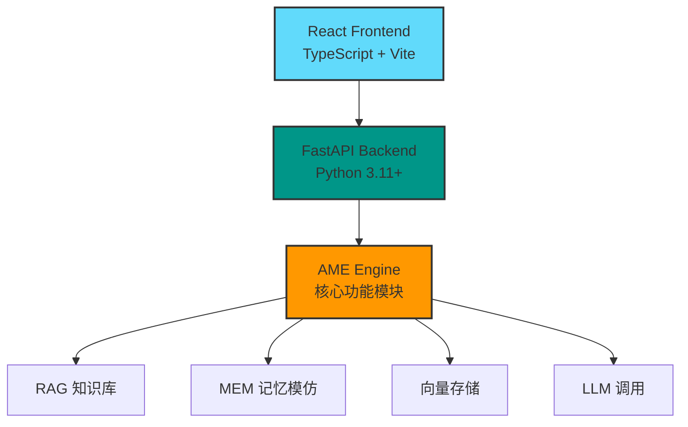
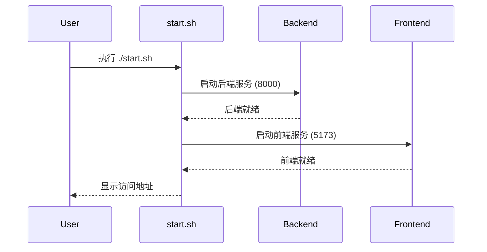
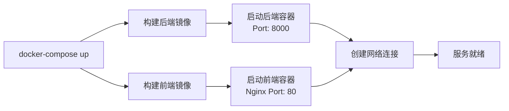
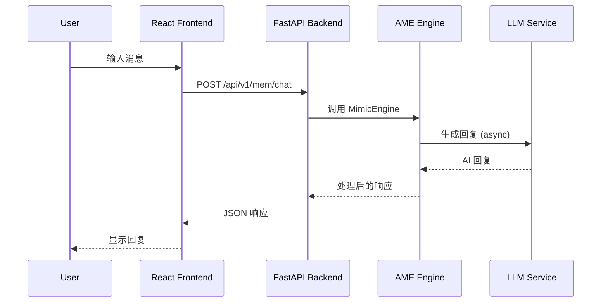
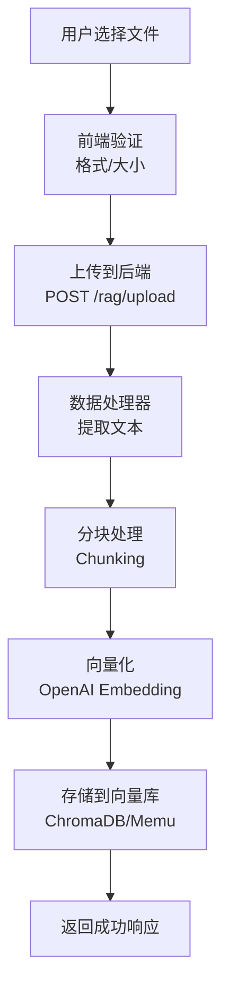
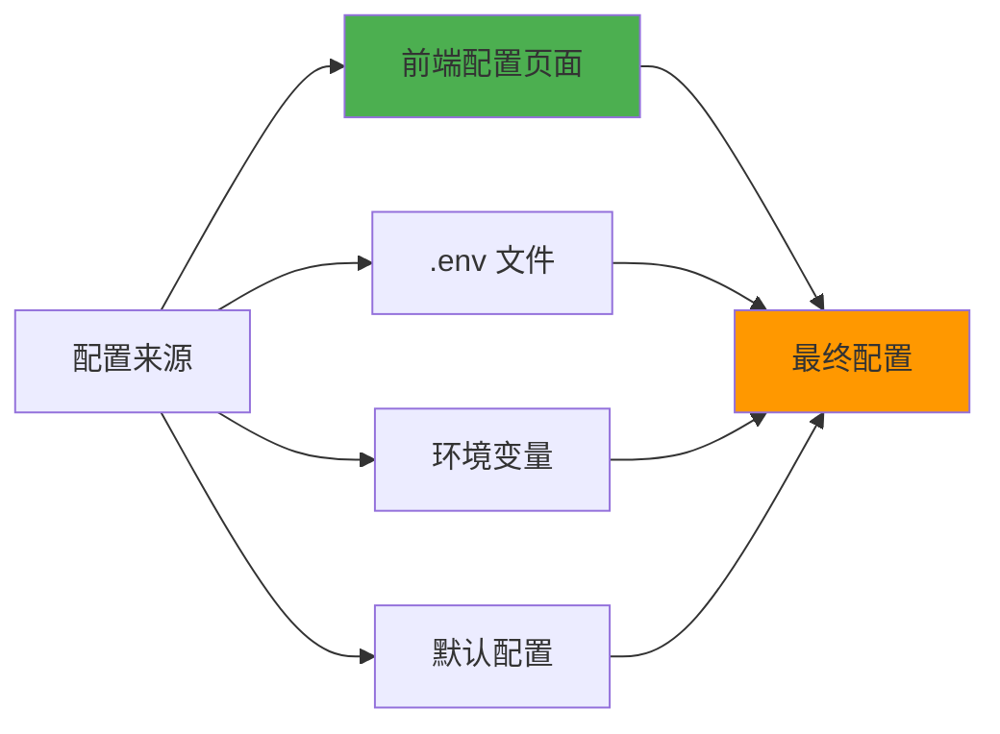
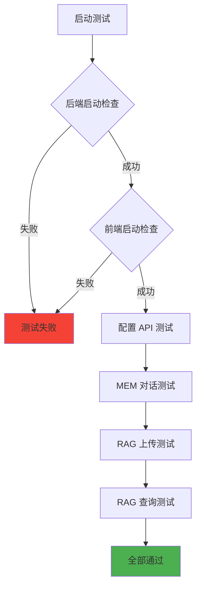
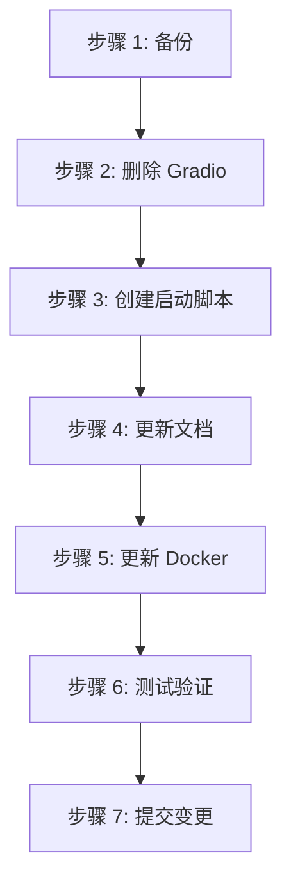

# 项目优化设计文档

## 1. 概述

### 1.1 优化目标

本次优化旨在简化 Another Me 项目架构，删除 Gradio Python 前端依赖，统一使用 React + FastAPI 架构，确保项目能够正常启动并运行。

### 1.2 当前架构问题

- **双前端并存**：同时维护 Gradio (Python) 和 React (TypeScript) 两套前端，造成维护成本高
- **依赖复杂**：Gradio 依赖增加项目复杂度和部署难度
- **启动困难**：多套前端导致启动流程复杂，文档不统一

### 1.3 目标架构



## 2. 架构变更

### 2.1 删除组件

| 组件 | 路径 | 删除原因 |
|------|------|---------|
| Gradio 应用 | `gradio_app/` | 与 React 前端功能重复 |
| Gradio Docker 构建脚本 | `docker-build-gradio.sh` | Gradio 专用部署脚本 |
| Gradio Dockerfile | `gradio_app/Dockerfile` | Gradio 构建配置 |
| Gradio 依赖 | `gradio_app/requirements.txt` | Python 前端依赖 |
| Gradio 启动脚本 | `gradio_app/run.sh` | Gradio 启动脚本 |

### 2.2 保留组件

| 组件 | 路径 | 作用 |
|------|------|------|
| React 前端 | `frontend/` | 用户界面层 |
| FastAPI 后端 | `backend/` | API 服务层 |
| AME 引擎 | `ame/` | 核心功能模块 |
| Docker 部署 | `deployment/` | 生产环境部署 |

### 2.3 新增/更新组件

| 组件 | 路径 | 变更内容 |
|------|------|---------|
| 统一启动脚本 | `start.sh` | 新增：一键启动前后端 |
| Docker Compose | `deployment/docker-compose.yml` | 更新：移除 Gradio 相关配置 |
| README | `README.md` | 更新：反映新架构 |
| 快速启动指南 | `QUICKSTART.md` | 更新：移除 Gradio 说明 |

## 3. 目录结构变更

### 3.1 优化前结构

```
another-me/
├── gradio_app/          # ❌ 删除：Python 前端
├── frontend/            # ✅ 保留：React 前端
├── backend/             # ✅ 保留：FastAPI 后端
├── ame/                 # ✅ 保留：核心引擎
├── deployment/          # ✅ 保留：部署配置
└── docker-build-gradio.sh  # ❌ 删除
```

### 3.2 优化后结构

```
another-me/
├── frontend/            # React + TypeScript + Vite
│   ├── src/
│   │   ├── api/         # API 客户端
│   │   ├── pages/       # 页面组件
│   │   ├── store/       # 状态管理 (Zustand)
│   │   ├── types/       # TypeScript 类型
│   │   └── styles/      # 样式文件
│   ├── package.json
│   └── vite.config.ts
├── backend/             # FastAPI + Python
│   ├── app/
│   │   ├── api/v1/      # API 端点
│   │   ├── core/        # 核心配置
│   │   ├── middleware/  # 中间件
│   │   ├── models/      # 数据模型
│   │   ├── services/    # 业务逻辑
│   │   └── main.py      # 应用入口
│   └── requirements.txt
├── ame/                 # AME 引擎
│   ├── rag/             # RAG 知识库
│   ├── mem/             # MEM 记忆
│   ├── vector_store/    # 向量存储
│   ├── llm_caller/      # LLM 调用
│   └── retrieval/       # 检索模块
├── deployment/          # Docker 部署
│   ├── docker/
│   │   ├── Dockerfile.backend
│   │   ├── Dockerfile.frontend
│   │   └── nginx.conf
│   ├── docker-compose.yml
│   └── deploy.sh
├── start.sh             # 新增：本地启动脚本
├── README.md            # 更新
└── QUICKSTART.md        # 更新
```

## 4. 启动流程设计

### 4.1 本地开发启动



#### 启动脚本设计 (start.sh)

```bash
#!/bin/bash
# Another Me - 统一启动脚本

# 功能：
# 1. 检查依赖环境 (Python 3.11+, Node.js 18+)
# 2. 启动后端服务 (后台运行)
# 3. 启动前端服务 (前台运行)
# 4. 提供停止脚本 (stop.sh)

# 启动步骤：
# - 检测 Python 和 Node.js 版本
# - 安装后端依赖
# - 启动后端 (uvicorn)
# - 安装前端依赖
# - 启动前端 (vite)
```

### 4.2 Docker 部署启动



#### Docker Compose 配置更新

移除 Gradio 服务，仅保留：
- **backend**: FastAPI 服务 (端口 8000)
- **frontend**: Nginx + React 构建产物 (端口 80)
- **network**: 内部网络通信
- **volumes**: 数据持久化

### 4.3 环境依赖

| 组件 | 依赖 | 版本要求 |
|------|------|---------|
| Frontend | Node.js | 18.0+ |
| Frontend | npm/yarn | latest |
| Backend | Python | 3.11+ |
| Backend | pip | latest |
| Docker | Docker | 20.0+ |
| Docker | Docker Compose | 2.0+ |

## 5. API 接口架构

### 5.1 后端 API 端点

```
/api/v1/
├── health                 # 健康检查
├── config/                # 配置管理
│   ├── GET  /load        # 加载配置
│   ├── POST /save        # 保存配置
│   └── POST /test        # 测试配置
├── rag/                   # RAG 知识库
│   ├── POST /upload      # 上传文档
│   ├── POST /query       # 查询知识
│   ├── GET  /docs        # 获取文档列表
│   └── DELETE /doc/{id}  # 删除文档
└── mem/                   # MEM 记忆
    ├── POST /chat        # 对话
    ├── POST /learn       # 学习记忆
    ├── GET  /memories    # 获取记忆列表
    └── DELETE /memory/{id} # 删除记忆
```

### 5.2 前端 API 集成

前端使用 Axios 调用后端 API：

```typescript
// api/client.ts
const API_BASE_URL = import.meta.env.VITE_API_BASE_URL || 'http://localhost:8000';

// 配置 Axios 实例
// 实现请求拦截器
// 实现响应拦截器
// 实现错误处理
```

## 6. 数据流设计

### 6.1 用户交互流程



### 6.2 知识库上传流程



## 7. 配置管理

### 7.1 环境变量配置

```env
# .env 文件结构

# OpenAI 配置
OPENAI_API_KEY=sk-xxx
OPENAI_BASE_URL=https://api.openai.com/v1
OPENAI_MODEL=gpt-3.5-turbo

# 应用配置
APP_NAME=Another Me
APP_VERSION=1.0.0
DEBUG=false

# 后端配置
BACKEND_HOST=0.0.0.0
BACKEND_PORT=8000

# 前端配置
VITE_API_BASE_URL=http://localhost:8000

# 数据目录
DATA_DIR=./data
```

### 7.2 配置优先级



优先级：前端配置 > 环境变量 > .env 文件 > 默认配置

## 8. 状态管理

### 8.1 前端状态架构 (Zustand)

```typescript
// store/index.ts

// configStore - 配置状态
interface ConfigState {
  apiKey: string;
  baseUrl: string;
  model: string;
  loadConfig: () => Promise<void>;
  saveConfig: (config) => Promise<void>;
}

// chatStore - 对话状态
interface ChatState {
  messages: Message[];
  loading: boolean;
  sendMessage: (text: string) => Promise<void>;
  clearMessages: () => void;
}
```

### 8.2 状态持久化

- **配置数据**：保存到后端 (JSON 文件)
- **对话历史**：保存到后端数据库/文件
- **用户偏好**：保存到 localStorage

## 9. 文件清理详细规划

### 9.1 需要删除的文件/目录

```
gradio_app/                    # 整个目录
├── components/
│   ├── __init__.py
│   ├── config_tab.py
│   ├── home_tab.py
│   ├── mem_tab.py
│   └── rag_tab.py
├── utils/
│   ├── __init__.py
│   └── session.py
├── Dockerfile
├── OPTIMIZATION_SUMMARY.md
├── VISUAL_PREVIEW.md
├── app.py
├── requirements.txt
└── run.sh

docker-build-gradio.sh         # 根目录文件
```

### 9.2 需要更新的文件

| 文件 | 更新内容 |
|------|---------|
| `README.md` | 移除 Gradio 相关内容，更新架构说明 |
| `QUICKSTART.md` | 移除 Gradio 启动步骤，更新为 React 前端 |
| `deployment/docker-compose.yml` | 移除 Gradio 服务配置 |
| `deployment/deploy.sh` | 更新启动说明 |

### 9.3 需要新增的文件

| 文件 | 用途 |
|------|------|
| `start.sh` | 本地开发一键启动脚本 |
| `stop.sh` | 本地开发停止脚本 |
| `.env.example` | 环境变量模板（如已存在则更新） |

## 10. 测试验证策略

### 10.1 单元测试

```
backend/tests/              # 后端测试
├── test_config_api.py     # 配置 API 测试
├── test_rag_api.py        # RAG API 测试
└── test_mem_api.py        # MEM API 测试

frontend/src/__tests__/     # 前端测试
├── ConfigPage.test.tsx    # 配置页面测试
└── ChatPage.test.tsx      # 对话页面测试
```

### 10.2 集成测试流程



### 10.3 验收标准

| 功能 | 验收条件 |
|------|---------|
| 后端启动 | ✅ 访问 http://localhost:8000/docs 正常 |
| 前端启动 | ✅ 访问 http://localhost:5173 正常显示 |
| 配置管理 | ✅ 可保存/加载 API Key |
| MEM 对话 | ✅ 可发送消息并收到回复 |
| RAG 上传 | ✅ 可上传文档并显示列表 |
| RAG 查询 | ✅ 可检索知识并返回结果 |
| Docker 部署 | ✅ docker-compose up 成功启动 |

## 11. 迁移步骤

### 11.1 实施步骤



### 11.2 详细操作

#### 步骤 1: 备份项目
```bash
git checkout -b feature/remove-gradio
git add .
git commit -m "Backup before removing Gradio"
```

#### 步骤 2: 删除 Gradio 相关文件
```bash
rm -rf gradio_app/
rm docker-build-gradio.sh
```

#### 步骤 3: 创建统一启动脚本
创建 `start.sh` 和 `stop.sh`

#### 步骤 4: 更新文档
更新 README.md 和 QUICKSTART.md

#### 步骤 5: 更新 Docker 配置
修改 `deployment/docker-compose.yml`

#### 步骤 6: 测试验证
按照测试验证策略执行

#### 步骤 7: 提交变更
```bash
git add .
git commit -m "Remove Gradio frontend, use React only"
```

## 12. 风险评估与应对

### 12.1 风险识别

| 风险 | 影响 | 概率 | 应对措施 |
|------|------|------|---------|
| 前端功能缺失 | 高 | 中 | 对比 Gradio 功能，确保 React 实现完整 |
| API 兼容性问题 | 中 | 低 | 保持后端 API 稳定，前端适配 |
| 启动脚本错误 | 中 | 中 | 充分测试各操作系统 |
| 文档不同步 | 低 | 高 | 统一更新所有文档 |

### 12.2 回滚方案

如果优化后出现严重问题：
```bash
git checkout main
git branch -D feature/remove-gradio
```

保留原有 Gradio 代码在独立分支：
```bash
git checkout -b archive/gradio-frontend
git push origin archive/gradio-frontend
```

## 13. 性能优化建议

### 13.1 前端优化

- **代码分割**：使用 React.lazy 和 Suspense 懒加载页面组件
- **资源优化**：Vite 生产构建自动优化
- **缓存策略**：API 响应缓存，减少重复请求
- **状态优化**：Zustand 轻量级状态管理

### 13.2 后端优化

- **异步处理**：LLM 调用已实现异步
- **连接池**：数据库连接池管理
- **缓存层**：LLM 响应缓存
- **日志优化**：结构化日志，便于调试

## 14. 未来扩展规划

### 14.1 短期规划（1-2个月）

- ✅ 完成 Gradio 移除
- ⏳ 完善 React 前端所有页面
- ⏳ 添加单元测试和集成测试
- ⏳ 优化用户体验和界面设计

### 14.2 长期规划（3-6个月）

- 📱 移动端适配（响应式设计）
- 🔐 用户认证和权限管理
- 📊 数据可视化增强
- 🌍 多语言支持
- ☁️ 云端部署方案

## 15. 参考资料

### 15.1 技术文档

- [FastAPI 官方文档](https://fastapi.tiangolo.com/)
- [React 官方文档](https://react.dev/)
- [Vite 官方文档](https://vitejs.dev/)
- [Zustand 文档](https://zustand-demo.pmnd.rs/)
- [Docker Compose 文档](https://docs.docker.com/compose/)

### 15.2 项目文档

- `DOCUMENTATION.md` - 完整技术文档
- `ame/README.md` - AME 引擎文档
- `PROJECT_SUMMARY.md` - 项目总结

---

**文档版本**: 1.0  
**创建日期**: 2024  
**最后更新**: 2024
